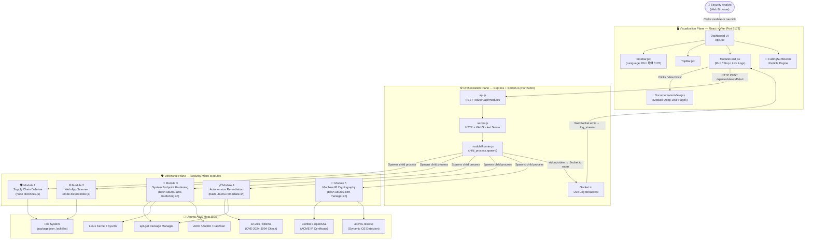
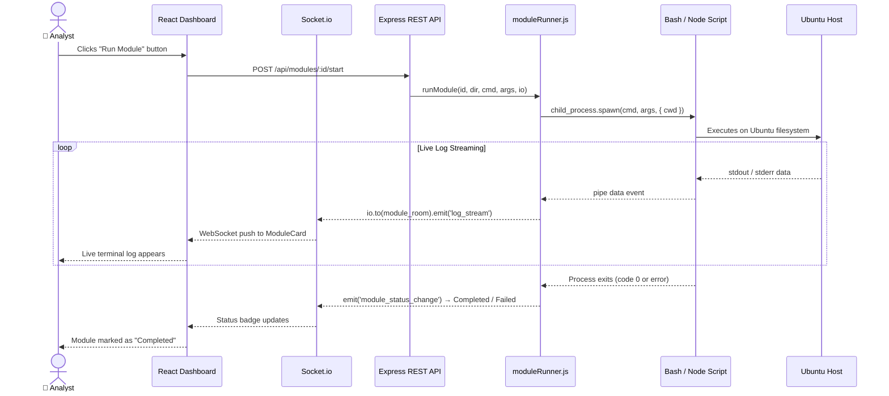
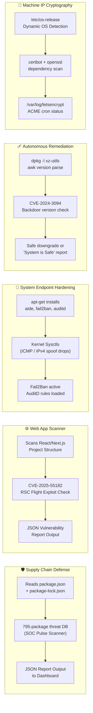
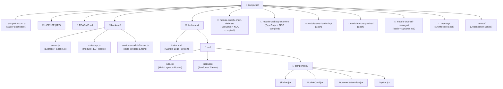
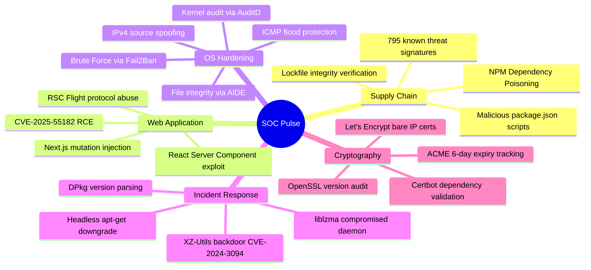

# 🌐 SOC Pulse — Full System Workflow & Architecture Diagram

> This document provides a complete, end-to-end visual map of how every layer of the SOC Pulse Command Center interacts — from the first browser click to the final bash execution on your Ubuntu AWS server.

---

## 🔁 System Overview Flow

---

## 🔄 Module Execution Lifecycle

---

## 🗂️ What Each Module Actually Does On The OS

---

## 🏗️ Static Project Directory Map

---

## 🔐 Security Threat Coverage Map

---

*Generated by SOC Pulse | Designed & Developed by **ULTRON***
