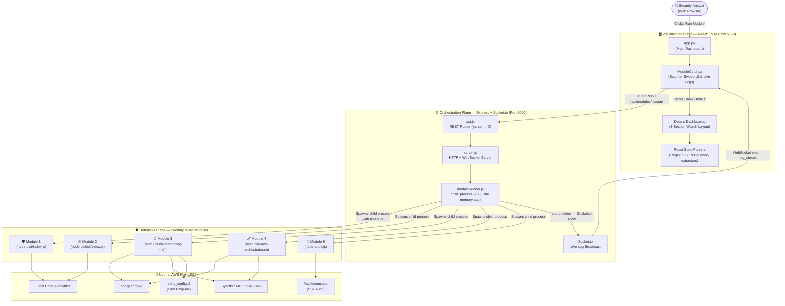
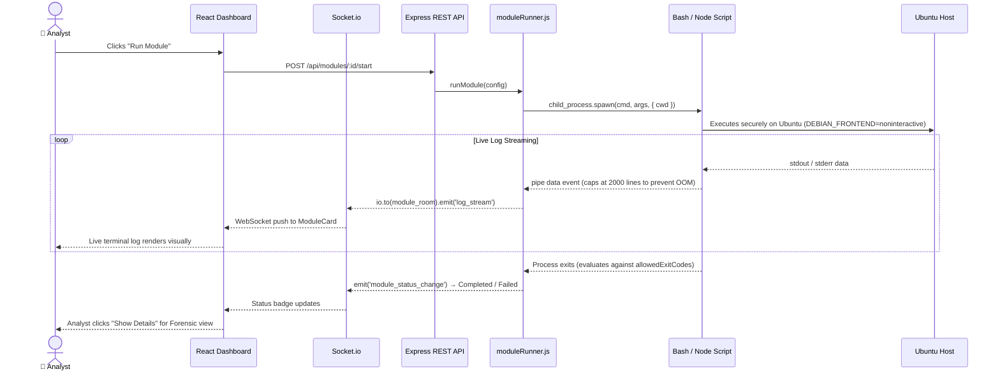
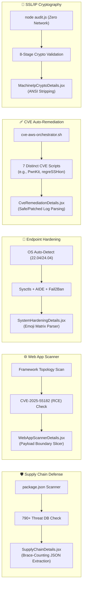
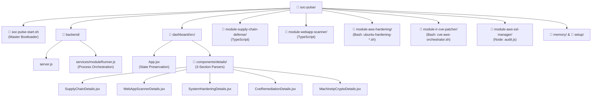
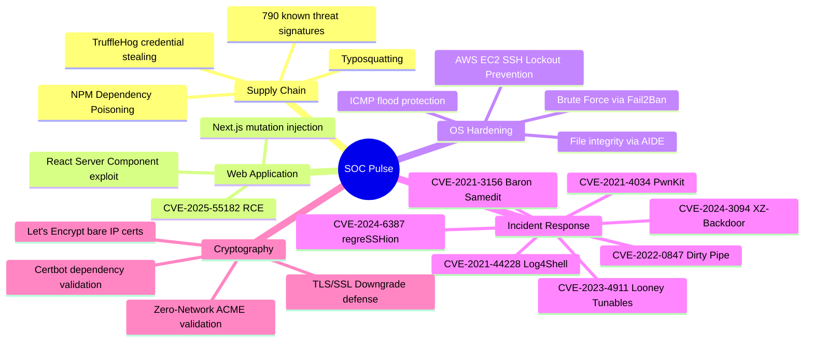

# 🌐 SOC Pulse — Full System Workflow & Architecture Diagram

> This document provides a complete, end-to-end visual map of how every layer of the SOC Pulse Command Center interacts — from the first browser click to the final bash execution on your Ubuntu AWS server. It has been updated to reflect the final, production-ready architecture.

---

## 🔁 System Overview Flow

---

## 🔄 Module Execution Lifecycle

---

## 🗂️ Internal Module Architecture

---

## 🏗️ Static Project Directory Map

---

## 🔐 Security Threat Coverage Map

---

*Generated by SOC Pulse | Production Grade Architecture*
